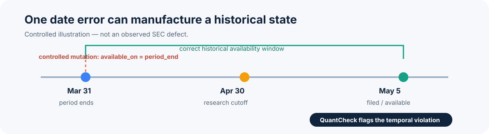
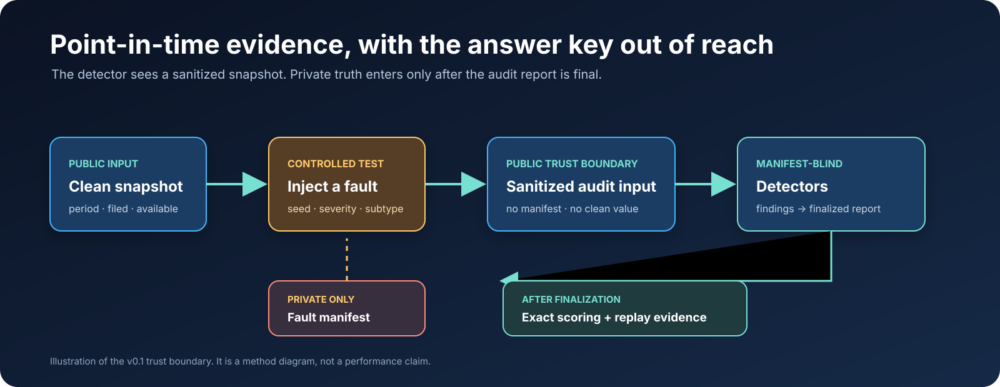
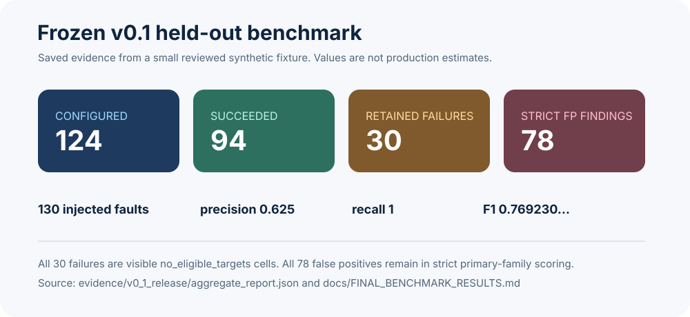
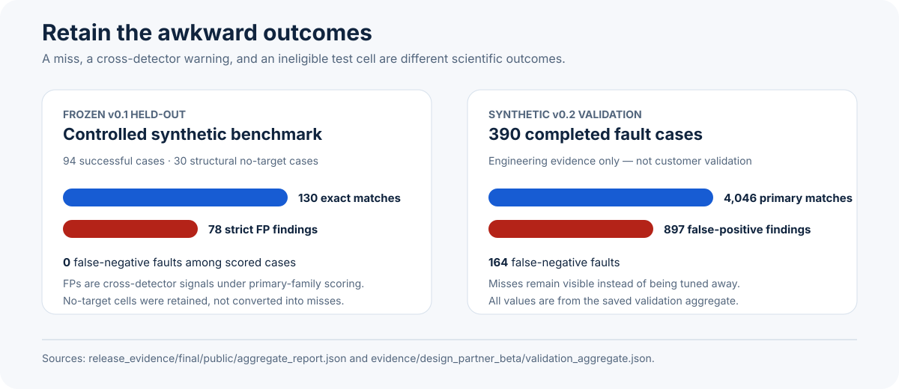
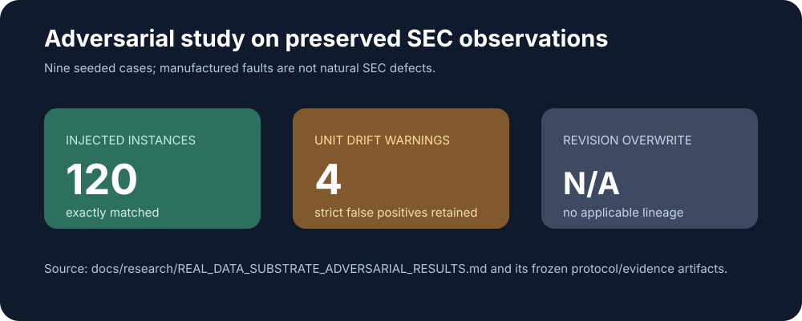
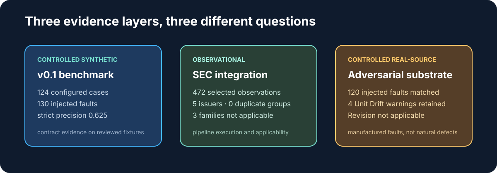
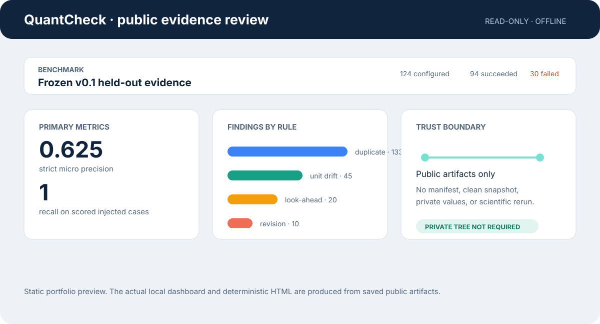

# QuantCheck

> **Can a historical financial research result be trusted if its input data could not have existed at the stated decision date?**
>
> QuantCheck deterministically injects narrow point-in-time data faults, audits a sanitized manifest-blind view, and scores results against private truth only after detection is finalized.



Visual key: blue marks the public/audited path, rust marks a controlled mutation or warning, and slate marks a private or not-applicable state. Labels do not rely on color alone.

## One concrete point-in-time failure

**Illustrative controlled fault — not an observed SEC defect.**

| Date | What should be true | What a contaminated dataset can claim |
| --- | --- | --- |
| Mar 31 | Quarter ends | — |
| Apr 30 | Research decision date: the fact is not yet available | Fact appears available and enters the analysis |
| May 5 | Fact is filed and becomes available | — |

A result produced on Apr 30 may look plausible while depending on information that was not available until May 5. QuantCheck tests this kind of failure without giving detectors the hidden answer key.

## Verified evidence at a glance

| Evidence layer | Result | Interpretation |
| --- | --- | --- |
| **Frozen v0.1 held-out benchmark** | 124 configured synthetic cases; 94 succeeded, 30 remained visible as `no_eligible_targets` failures, 0 incomplete. Strict micro precision `0.625`, recall `1`, F1 `0.769230…`. | Controlled evidence on a small reviewed synthetic fixture—not a general performance estimate. |
| **Failure honesty** | 78 strict false-positive findings were retained; all were cross-detector findings under primary-family scoring. | The benchmark does not tune away inconvenient behavior. |
| **Controlled research sensitivity** | 90/90 successful fault cases changed the configured research output; 90/90 had manifest-assisted exact replay restoration. | Narrow sensitivity demonstrations—not returns, alpha, or automatic repair. |
| **Real SEC substrate experiment** | Across nine prospectively frozen injected cases, all 120 manufactured fault instances matched; four Unit Drift warnings remained strict false positives. | Controlled faults on real-source observations—not natural SEC defects or broad real-world accuracy. |

[Demo](#demo) · [Paper](#paper) · [Reproduce](#reproduce)

---

## The problem

Historical financial research is vulnerable to data states that are internally plausible but historically impossible:

- a fact becomes visible before it was filed;
- a value changes scale while its unit label remains unchanged;
- one observation is counted twice; or
- a later revision replaces an earlier historical state.

QuantCheck treats the dataset as part of the experiment. It asks whether a specified research result can be manufactured by one of these controlled data-integrity failures.

## Why backtests can be contaminated

Point-in-time analysis needs distinct dates for the reporting period, filing, availability, research cutoff, and runtime. In QuantCheck’s v0.1 day-level contract, a fact is visible only when `available_on <= as_of_date`.

A backtest can be mathematically correct and still be historically invalid if this boundary is wrong.

## How QuantCheck works



The detector never receives the manifest, clean snapshot, target IDs, seed, severity, or injector-only metadata. The scorer can read private truth only after the audit report is finalized.

## Four frozen v0.1 fault families

| Family | Supported controlled subtype | Detector question |
| --- | --- | --- |
| Look-Ahead Timestamp | `period_end_substitution` | Did a period-end date make a fact visible before its filing? |
| Unit Drift | `value_scaled_unit_unchanged` | Does an exact comparable series contain a scale discontinuity? |
| Duplicate Observations | `exact_occurrence_copy` | Does an exact fingerprint occur more than once? |
| Revision Overwrite | `later_vintage_in_earlier_state` | Does an earlier state contain a later declared revision? |

These are deliberately narrow contracts, not universal anomaly detection, statement reconstruction, fuzzy deduplication, or restatement inference.

## Manifest-blind evaluation

QuantCheck separates generation from evaluation:

1. Build a clean point-in-time snapshot.
2. Inject one deterministic, configured fault and retain its truth privately.
3. Sanitize the corrupted snapshot for audit.
4. Run all detectors.
5. Finalize findings.
6. Score exact matches against the private manifest.

Clean controls use the same detector and scoring contracts. Cross-detector findings remain visible; they are not suppressed to improve a headline metric.

## Benchmark

The frozen v0.1 held-out benchmark contains four fault profiles, three severities, ten reserved final seeds, and four clean controls.

| Metric | Saved v0.1 result |
| --- | ---: |
| Configured / successful / failed / incomplete | 124 / 94 / 30 / 0 |
| Injected faults / findings | 130 / 208 |
| True positives / false negatives | 130 / 0 |
| Strict false positives | 78 |
| Strict micro precision / recall / F1 | 0.625 / 1 / 0.769230… |
| Controlled output changed / replay restored | 90 / 90 |

The complete breakdown, denominators, and exact Decimal values are in [Final benchmark results](docs/FINAL_BENCHMARK_RESULTS.md).



## Failure analysis: what stays visible

The weak results are part of the result:

- 30 cases failed at injection with `no_eligible_targets`: Look-Ahead at high severity, and Revision Overwrite at medium and high severity.
- All 78 strict false positives are cross-detector findings under the predeclared primary-family scoring rule.
- Revision Overwrite has an eligible-clean denominator of 11; its false-positive rate must not be compared casually with the larger-denominator profiles.
- Recall of 1 is measured on the specified synthetic fixture; it is not a general sensitivity claim.



## Real-source studies

Two evidence layers use selected SEC Company Facts histories and must not be conflated.

**Observational integration study.** QuantCheck accepted 472 selected observations from five issuers. Exact Duplicate had 472 singleton fingerprints and zero findings. Look-Ahead, Revision Overwrite, and Unit Drift had zero eligible opportunities under the selected adapter semantics. This establishes narrow real-source pipeline execution and an exact-duplicate null result—not broad detector validation. Because no findings were emitted, there was no finding-level human adjudication; zero findings are not a certification of the source data.

**Adversarial study on real-data substrate.** A separately Git-frozen study preserved the selected SEC values and provenance while applying existing deterministic injectors. Across nine seeded Look-Ahead, Duplicate, and Unit Drift cases, all 120 manufactured fault instances were exactly matched. Four additional Unit Drift warnings remain strict false positives. Revision Overwrite was not applicable.



Read the [observational results](REAL_DATA_RESULTS.md), [real-substrate adversarial results](REAL_DATA_SUBSTRATE_ADVERSARIAL_RESULTS.md), and [study limitations](REAL_DATA_LIMITATIONS.md).



## Research-impact experiment

Each fault family has one deliberately narrow controlled comparison: availability count, exact aggregate, occurrence count, or frozen-vintage growth ranking. The question is whether the configured output changes under controlled corruption, then returns exactly after manifest-assisted replay.

This is evidence about data sensitivity—not investment performance, alpha, Sharpe, financial loss, or automated remediation.

## Architecture

- `src/quantcheck/` — typed deterministic core, fault contracts, audit boundary, scoring, and artifact model.
- `docs/` — methodology, fault contracts, benchmark evidence, privacy boundary, reproducibility, and limitations.
- `dashboard/` — local read-only Streamlit review surface.
- `release_evidence/` — frozen v0.1 public evidence package.
- `evidence/` — versioned synthetic, real-source, and supply-chain evidence artifacts.
- `tests/` — offline deterministic and boundary-focused tests.

## Quick start

Requires Python 3.12 and [`uv`](https://docs.astral.sh/uv/).

```bash
uv sync --all-groups
uv run quantcheck benchmark smoke --output /tmp/qc-smoke
uv run python scripts/render_html_summary.py /tmp/qc-smoke \
  --output /tmp/qc-smoke/summary.html
```

The smoke benchmark is offline and produces 12 cases. See the [CLI contract](docs/CLI_CONTRACT.md) for the supported command surface.

## Demo

The demo reads saved public artifacts; it does not rerun science or access private manifests.

```bash
uv run quantcheck benchmark smoke --output /tmp/qc-demo
uv run python scripts/render_html_summary.py /tmp/qc-demo \
  --output /tmp/qc-demo/summary.html
uv run --group dashboard streamlit run dashboard/app.py -- \
  --artifacts /tmp/qc-demo
```

The local dashboard and generated HTML are public-artifact-only views. They continue to work with the entire private tree removed. See [Demo and presentation boundary](docs/DASHBOARD_AND_HTML.md).



### Video upload placeholder

The narrated demo is intentionally not linked yet. When the cut is ready, upload the final file at `video/QuantCheck_demo.mp4` and replace this note with its public GitHub or portfolio link.

## Reproduce

To reproduce the frozen v0.1 held-out evidence from the matching release checkout:

```bash
uv sync --frozen --all-groups
uv run python scripts/release_freeze.py --check
uv run python scripts/run_release_benchmark.py --output release_evidence/final
uv run python scripts/verify_release_evidence.py \
  --source release_evidence/final \
  --public-only release_evidence/public_only \
  --html release_evidence/public_only/summary.html
uv run python scripts/release_checksums.py --check
```

Logical artifacts are designed to be deterministic across output roots and tested hash seeds; runtime metadata is intentionally environment-specific. Read [Reproducibility](docs/REPRODUCIBILITY.md).

## Current implementation status

The immutable `v0.1.0` tag remains the historical release baseline. The current worktree is `0.2.0.dev0`, a beta engineering candidate rather than a production release. It includes the typed `quantcheck` package, deterministic benchmark and artifact layers, the six root CLI command groups, public-only HTML and dashboard surfaces, a narrow SEC Company Facts adapter, additive external-dataset policy/execution paths, and synthetic development/validation evidence.

The current candidate has no completed customer pilot, customer adjudication, published OCI image, trusted release attestation, production deployment, or held-out v0.2 result. Local package and security evidence does not substitute for those external gates. See [IMPLEMENT.md](IMPLEMENT.md) for the operational record.

The SEC adapter is intentionally narrow: one CIK at a time, explicit contact-bearing user-agent, cache-first exact-byte persistence, offline replay, allowlisted concepts/units/forms/date shapes, and day-level `available_on == filed_on` semantics. It does not reconstruct statements, harmonize concepts, convert currencies or scale, infer revisions, or make intraday claims.

## CLI usage

```bash
# Run the deterministic offline smoke benchmark.
uv run quantcheck benchmark smoke --output /tmp/qc-smoke --json

# Run one saved, fully expanded case through the staged workflow.
uv run quantcheck inject --case case.json --output /tmp/qc-case
uv run quantcheck audit --dir /tmp/qc-case
uv run quantcheck evaluate --dir /tmp/qc-case

# Explain one saved public finding.
uv run quantcheck explain --dir /tmp/qc-case --finding <finding_id>
```

The supported surface is documented in the [CLI contract](docs/CLI_CONTRACT.md), including exit codes and privacy rules.

## Reproducing v0.2 synthetic engineering evidence

The v0.2 runner keeps development and validation separate, pairs every fault case with a clean control, preserves failed/incomplete statuses, and rebuilds aggregates from public artifacts without private manifests or snapshots.

```bash
uv run python scripts/run_benchmark_v2_evidence.py \
  --partition all --output benchmark_evidence_v0_2
uv build --offline
uv run python scripts/build_beta_evidence.py \
  --benchmark-evidence benchmark_evidence_v0_2 \
  --output evidence/design_partner_beta
```

This is synthetic engineering evidence only; it is not customer validation. The held-out v0.2 partition remains separately gated.

## Limitations

QuantCheck is not production ready, customer validated, or a complete financial-data platform. It does not claim natural-error prevalence, broad vendor-feed accuracy, investment performance, automatic repair, universal SEC coverage, statement reconstruction, or universal restatement detection.

The primary v0.1 evidence is synthetic. The real-data studies are narrow and explicitly distinguish observed data from manufactured faults. Read the full [limitations](docs/LIMITATIONS.md).

## Development checks

Requires Python `>=3.12,<3.13` and `uv`.

```bash
uv python install 3.12
uv sync --all-groups
uv run ruff check .
uv run ruff format --check .
uv run mypy src tests
uv run pytest
uv run quantcheck --help
```

## Paper

[**QuantCheck: Adversarial Testing of Point-in-Time Financial Research Data**](QUANTCHECK_RESEARCH_PAPER.md) explains the threat model, benchmark, real-data evidence layers, failure analysis, and limitations. The [public evidence ledger](QUANTCHECK_PUBLIC_EVIDENCE_LEDGER.md) is the canonical source for public claims and numbers.

## Documentation

| Need | Start here |
| --- | --- |
| Method and audit boundary | [Methodology](docs/METHODOLOGY.md) |
| Benchmark evidence | [Final benchmark results](docs/FINAL_BENCHMARK_RESULTS.md) |
| Fault contracts | [Fault catalogue](docs/faults/) |
| Public/private artifact boundary | [Artifacts and privacy](docs/ARTIFACTS_AND_PRIVACY.md) |
| Reproducibility | [Reproducibility](docs/REPRODUCIBILITY.md) |
| Visual system and evidence sources | [Visual source register](docs/assets/VISUAL_SOURCES.md) |
| SEC and external data | [External datasets](docs/EXTERNAL_DATASETS.md) |
| Current engineering status | [IMPLEMENT.md](IMPLEMENT.md) |
| Contributing | [CONTRIBUTING.md](CONTRIBUTING.md) |

## Repository map

- `src/quantcheck/` — package implementation.
- `dashboard/` — standalone local read-only Streamlit app.
- `scripts/` — repository development tools.
- `tests/` — offline deterministic tests.
- `docs/` — current method, contracts, evidence, and operations.
- `reference/` — historical documents only; they do not describe current behavior.
- `AGENTS.md`, `PROJECT_SCOPE.md`, `MVP_ACCEPTANCE_CRITERIA.md`, `IMPLEMENT.md` — governing instructions, scope, acceptance criteria, and operational status.
